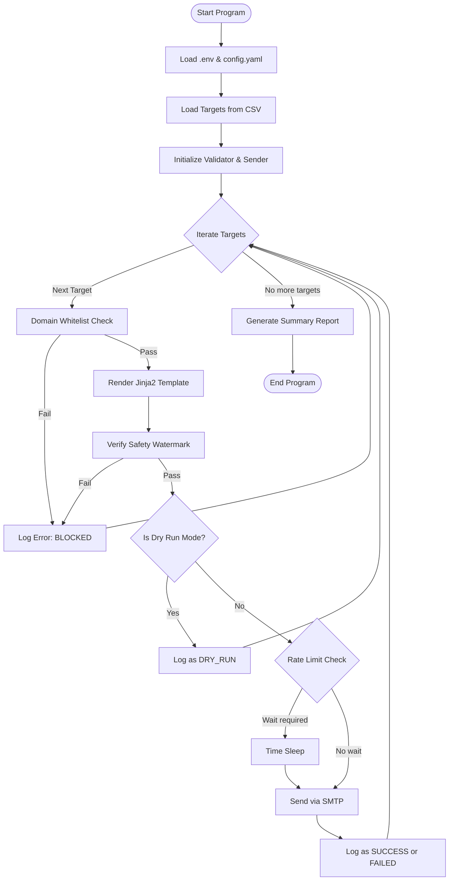
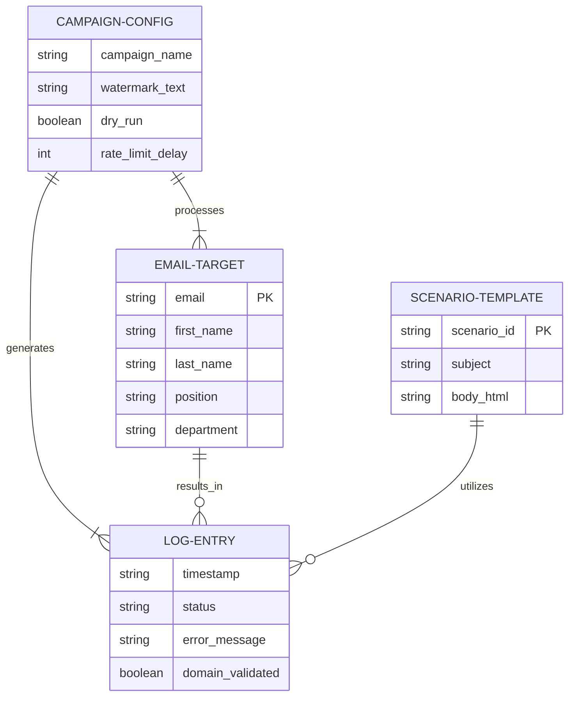

<div align="center">

# PROJECT REPORT

## PHALANX CHECK: Authorized Phishing Email Simulation Tool

<br><br><br>

**By**

**[Haripriyan B.A]**


<br><br><br>

</div>

<div style="page-break-after: always;"></div>

# TABLE OF CONTENTS

| CHAPTER NO. | TITLE |
| :--- | :--- |
| **I** | **INTRODUCTION** |
| | 1.1 An Overview |
| | 1.2 Objectives of the Project |
| | 1.3 Scope of the Project |
| **II** | **SYSTEM ANALYSIS** |
| | 2.1 Existing system |
| | 2.2 Proposed System |
| | 2.3 Hardware Specification |
| | 2.4 Software Specification |
| **III** | **SYSTEM DESIGN** |
| | 3.1 Design Process |
| | 3.2 Database Design |
| | 3.3 Input Design |
| | 3.4 Output Design |
| **IV** | **IMPLEMENTATION AND TESTING** |
| | 4.1 System Implementation |
| | 4.2 System Maintenance |
| | 4.3 System Testing |
| | 4.4 Quality Assurance |
| **V** | **CONCLUSION AND FUTURE ENHANCEMENT** |
| **VI** | **ANNEXURES** |
| | A. Screenshots |
| | B. Source code |
| | C. Bibliography |

<div style="page-break-after: always;"></div>

# CHAPTER I: INTRODUCTION

## 1.1 An Overview

In the modern digital landscape, cybersecurity threats have evolved from brute-force technical attacks to sophisticated psychological manipulations. Among these, "phishing" remains one of the most prevalent and damaging vectors. Phishing is a form of social engineering where attackers deceive individuals into revealing sensitive information, such as passwords or financial details, by masquerading as a trustworthy entity in electronic communications. 

Despite advanced firewalls, intrusion detection systems, and spam filters, the human element remains the weakest link in the security chain. A single employee clicking a malicious link or downloading an infected attachment can compromise an entire corporate network, leading to data breaches, financial loss, and severe reputational damage. To counter this, organizations must proactively educate their workforce. Security awareness training is no longer a luxury; it is a critical compliance and operational requirement.

**Phalanx Check** was conceived to address this specific need. Named after the ancient military formation known for its impenetrable shield wall, the project aims to test and fortify an organization's "human phalanx." It is a specialized, Command Line Interface (CLI) based tool designed for corporate security teams to run authorized, ethical, and safe phishing simulations. By sending harmless, simulated phishing emails to employees, organizations can identify vulnerabilities, track awareness levels, and provide targeted training to those who need it most.

Unlike malicious tools, Phalanx Check is built with strict ethical guidelines and safety mechanisms at its core. It operates exclusively on authorized domains, ensuring that simulations cannot accidentally target external entities or the general public. 

## 1.2 Objectives of the Project

The primary goal of Phalanx Check is to provide a reliable, safe, and easily deployable framework for conducting internal phishing campaigns. The specific objectives include:

1. **Safe Simulation Environment:** To create a tool that strictly prevents the accidental sending of emails to unauthorized external domains. This is achieved through a rigid domain whitelisting mechanism that acts as the primary gatekeeper.
2. **Realistic Scenario Generation:** To support realistic phishing templates that mimic common corporate communications (e.g., IT Password Resets, HR Bonus Announcements, Urgent Invoice Approvals) to accurately test employee vigilance.
3. **Ethical Compliance:** To ensure transparency by forcibly injecting a safety watermark (e.g., "[SECURITY SIMULATION TEST - DO NOT PANIC]") into every generated email, ensuring that the tool cannot be used for actual malicious purposes.
4. **Controlled Execution:** To implement rate limiting to prevent corporate mail servers from classifying the simulation as a spam flood or denial-of-service (DoS) attack.
5. **Comprehensive Audit Logging:** To maintain an exhaustive, structured JSON log of every simulation attempt, recording successes, failures, and blocked attempts for post-campaign analysis and compliance auditing.
6. **Ease of Integration:** To allow security teams to easily import target lists via CSV files and manage configurations through a simple YAML file, minimizing deployment friction.

## 1.3 Scope of the Project

The scope of Phalanx Check is clearly defined to focus on the delivery and tracking of simulated phishing emails within a controlled corporate environment. 

**In-Scope:**
*   Parsing and validating target employee data from CSV files.
*   Generating customized email content using the Jinja2 templating engine to inject personalized variables (First Name, Last Name, Department, etc.).
*   Validating target email addresses against a pre-configured list of authorized internal domains.
*   Sending emails via standard SMTP protocols with TLS encryption.
*   Providing a "Dry-Run" mode to allow administrators to test campaign configurations without dispatching actual emails.
*   Logging all activities locally to a structured JSON file and a human-readable text log.

**Out-of-Scope:**
*   **Click Tracking & Credential Harvesting:** In its current version, the tool focuses on the *delivery* of the simulation. It does not host a malicious web server to track if users click the links or to capture entered credentials. All links in the templates are intentionally disabled (`#simulation-link-disabled`).
*   **External Targeting:** The system strictly prohibits and blocks any attempt to send emails to domains not explicitly listed in the configuration file.
*   **SMS/Voice Phishing (Smishing/Vishing):** The tool is restricted solely to email-based (SMTP) phishing simulations.

<div style="page-break-after: always;"></div>

# CHAPTER II: SYSTEM ANALYSIS

## 2.1 Existing System

Historically, organizations have relied on either expensive commercial platforms or complex open-source frameworks to conduct phishing simulations. 

Commercial platforms (such as KnowBe4, Proofpoint, or Cofense) offer extensive features, including tracking, reporting, and integrated training modules. However, they come with significant licensing costs, making them inaccessible for small to medium-sized enterprises (SMEs) or academic institutions conducting research. Furthermore, these platforms often require complex integration with corporate directories and extensive onboarding.

On the open-source front, tools like *GoPhish* are powerful and widely used. However, they are designed as full-fledged campaign managers with web interfaces, database backends, and external landing pages. While feature-rich, they often lack strict, hardcoded safety rails. A misconfiguration in an open-source tool can easily result in thousands of spam emails being sent to external, unauthorized addresses, potentially violating anti-spam laws (like CAN-SPAM or GDPR) and blacklisting the company's IP address.

**Drawbacks of Existing Systems:**
*   High cost of ownership for commercial solutions.
*   Steep learning curve and complex infrastructure requirements for open-source frameworks.
*   Lack of mandatory, hardcoded safety gates (like forced watermarks and strict domain whitelists) in open-source tools, increasing the risk of accidental misuse or external spamming.

## 2.2 Proposed System

**Phalanx Check** is proposed as a lightweight, secure, and developer-friendly alternative specifically tailored for internal, authorized use. It strips away the complexity of managing web servers and databases, focusing entirely on the safe, verifiable delivery of simulated emails.

The proposed system operates entirely from the Command Line Interface (CLI). It uses a straightforward configuration file (`config.yaml`) and reads target data from a simple CSV file. 

**Advantages of the Proposed System:**
*   **Zero-Infrastructure:** Requires no databases, web servers, or complex hosting. It runs directly from the security officer's terminal.
*   **Fail-Safe Architecture:** The inclusion of mandatory domain validation ensures that even if a user accidentally imports a CSV containing external addresses (e.g., `user@gmail.com`), the system will block the execution for those specific targets and log the anomaly.
*   **Ethical by Design:** The system programmatically forces a visible watermark onto every email body. Even if an administrator creates a custom template and forgets the disclaimer, the system's templating engine will append it automatically, ensuring the tool cannot be weaponized.
*   **Cost-Effective:** As a Python-based script utilizing standard libraries, it is entirely free to deploy and modify.

## 2.3 Hardware Specification

Because Phalanx Check is a lightweight CLI application that performs batch processing of text and network requests, its hardware requirements are exceedingly minimal. It can run on virtually any modern hardware.

*   **Processor:** 1.0 GHz dual-core processor or higher (Intel/AMD/ARM).
*   **Memory (RAM):** Minimum 512 MB (2 GB recommended for large CSV batch processing).
*   **Storage:** Less than 50 MB of disk space for the application files and dependencies. Additional space (approx. 100 MB) is required for generating local JSON and text log files over time.
*   **Network:** An active internet or intranet connection capable of reaching the designated SMTP server over port 25, 465, or 587.

## 2.4 Software Specification

The software stack was chosen for its reliability, cross-platform compatibility, and robust standard libraries.

*   **Operating System:** Windows 10/11, macOS, or any modern Linux distribution (Ubuntu, Debian, CentOS).
*   **Programming Language:** Python 3.9 or higher.
*   **Core Libraries (Dependencies):**
    *   `pydantic` (v2.0+): For strict data validation and parsing of configuration and CSV inputs.
    *   `Jinja2`: A fast, expressive templating engine used for rendering the dynamic HTML email bodies.
    *   `PyYAML`: For parsing the `config.yaml` configuration file.
    *   `python-dotenv`: For securely loading SMTP credentials from a local `.env` file, ensuring secrets are not hardcoded.
*   **Standard Libraries:** `smtplib` (for email delivery), `email.mime` (for constructing multipart MIME messages), `csv`, `json`, `logging`.

<div style="page-break-after: always;"></div>

# CHAPTER III: SYSTEM DESIGN

## 3.1 Design Process

The design of Phalanx Check followed an iterative, security-first methodology. The architecture is modular, separating concerns into distinct files to enhance readability and maintainability. The process was divided into four logical pipelines: Configuration Loading, Data Validation, Template Rendering, and Secure Delivery.

Below is the Flow Chart diagram illustrating the system's execution path.



## 3.2 Database Design

While Phalanx Check does not use a traditional Relational Database Management System (RDBMS) like MySQL or PostgreSQL, it relies on flat-file databases (CSV for input, JSON for output). 

The data structures are strictly enforced in memory using Pydantic models. Below is the Entity-Relationship (ER) Diagram representing the logical relationships between the core data components.



### JSON Log Schema Definition
Every execution generates an entry in `logs/simulation_log.json`. The schema acts as the persistent "database" of the application:
*   `timestamp` (ISO 8601 String)
*   `campaign_name` (String)
*   `target_email` (String)
*   `target_name` (String)
*   `scenario` (String)
*   `status` (String: "success", "failed", "skipped", "dry_run")
*   `error_message` (String or Null)
*   `watermark_applied` (Boolean)
*   `domain_validated` (Boolean)

## 3.3 Input Design

Input design focuses on user-friendliness while maintaining strict data integrity. There are three primary input vectors:

1.  **Environment Variables (`.env`):** Used exclusively for highly sensitive data. This prevents passwords from being accidentally committed to version control systems.
    *   Inputs: `SMTP_HOST`, `SMTP_PORT`, `SMTP_USERNAME`, `SMTP_PASSWORD`.
2.  **Configuration File (`config.yaml`):** Used for campaign-level settings.
    *   Inputs: Whitelisted domains, rate limits, company metadata (name, support email), and the global `dry_run` toggle.
3.  **Target List (`targets.csv`):** The operational payload.
    *   The application uses Python's `csv.DictReader` to parse the file.
    *   Pydantic enforces that `email`, `first_name`, and `last_name` must be present and correctly formatted. If an email is malformed (e.g., missing an '@' symbol), Pydantic rejects the specific row during the loading phase, preventing runtime crashes later in the execution.

## 3.4 Output Design

The system provides dual-output mechanisms catering to both real-time monitoring and historical auditing.

1.  **Console Output (Real-time):**
    *   The CLI utilizes Python's `logging` library to output formatted, timestamped messages to standard output (`stdout`).
    *   It uses clear prefixes (`[+]` for success, `[X]` for failure/blocks, `[!]` for warnings) ensuring the operator can monitor the batch process in real-time. Windows CP1252 encoding compatibility is maintained by utilizing ASCII-safe symbols instead of complex Unicode emojis.
2.  **Structured JSON Output (Auditing):**
    *   A continuous array of JSON objects is maintained in `logs/simulation_log.json`.
    *   This design allows security analysts to easily import the JSON file into platforms like Splunk, ELK Stack (Elasticsearch, Logstash, Kibana), or Microsoft Sentinel for dashboarding and compliance reporting.

<div style="page-break-after: always;"></div>

# CHAPTER IV: IMPLEMENTATION AND TESTING

## 4.1 System Implementation

The implementation was executed in Python, chosen for its readability and extensive ecosystem. The project is divided into five core modules:

1.  **`models.py`:** Contains the Pydantic classes. This is the bedrock of the application's stability. By forcing all inputs (CSV rows, YAML configs) through these classes, we guarantee that by the time data reaches the sender logic, it is 100% valid.
2.  **`templates.py`:** Implements the `TemplateEngine` class using Jinja2. It holds the pre-built HTML templates (IT Password Reset, HR Bonus, Urgent Invoice). A critical implementation detail here is the `_fallback_watermark_html()` method, which forcibly appends the safety watermark if the template engine detects it is missing from the final rendered HTML.
3.  **`validator.py`:** Implements the `DomainValidator` class. It loads authorized domains into a Python `frozenset` to allow for $O(1)$ constant-time lookups, ensuring highly efficient validation even for lists with thousands of targets.
4.  **`sender.py`:** Implements the `SimulationSender` class. It handles the `smtplib` connection, constructs the `MIME` multipart emails, executes the `time.sleep()` rate limiting, and writes to the JSON log.
5.  **`main.py`:** The orchestrator. It parses CLI arguments using `sys.argv`, loads the configs, coordinates the validator and sender, and prints the final summary report to the console.

## 4.2 System Maintenance

Maintenance of Phalanx Check is designed to be straightforward, requiring minimal programming knowledge from the end-user.

*   **Updating Targets:** The security team simply replaces the `targets.csv` file with a fresh export from their HR system or Active Directory.
*   **Adding Scenarios:** To add a new phishing scenario, an administrator can edit the `SCENARIO_TEMPLATES` dictionary in `templates.py`, providing a new subject line and HTML body utilizing Jinja2 variables.
*   **Credential Rotation:** If the SMTP password changes, the administrator only needs to update the local `.env` file. No code changes are required.

## 4.3 System Testing

Rigorous testing was conducted to ensure the safety mechanisms function flawlessly.

1.  **Dry-Run Testing:** The system was executed with `dry_run: true`. It successfully validated domains, rendered templates, and wrote to logs without initiating any network connections to the SMTP server.
2.  **Domain Whitelist Testing (Negative Testing):** A mock target with the email `external.user@gmail.com` was injected into the target list. The system successfully caught the unauthorized domain, blocked the rendering and sending processes for that specific target, logged an `ERROR`, and seamlessly continued processing the remaining valid internal targets.
3.  **Rate Limit Testing:** The `delay_seconds` was set to 2. The execution time was monitored to ensure the application yielded the thread for exactly 2 seconds between successful SMTP dispatches, verifying the anti-flooding mechanism.
4.  **SMTP Failure Testing:** Invalid SMTP credentials were provided. The system gracefully handled the authentication exception, logged the specific SMTP error to the JSON file as `failed`, and did not crash the application.

## 4.4 Quality Assurance

Quality Assurance (QA) was maintained throughout the development lifecycle:
*   **PEP 8 Compliance:** All Python code adheres strictly to PEP 8 style guidelines, ensuring readability.
*   **Type Hinting:** Extensive use of Python 3 type hints (`-> None`, `list[str]`, etc.) was employed. This allows static type checkers (like `mypy`) to identify potential bugs before runtime.
*   **Exception Handling:** Broad `try-except` blocks are utilized around network I/O operations (SMTP sending) and File I/O (CSV reading, JSON writing) to ensure that a failure in processing one target does not halt the entire batch campaign.

<div style="page-break-after: always;"></div>

# CHAPTER V: CONCLUSION AND FUTURE ENHANCEMENT

## Conclusion

The development of **Phalanx Check** successfully demonstrates that effective security awareness tools do not need to be overly complex, expensive, or risky to operate. By focusing heavily on strict validation, fail-safe mechanisms, and an ethical-by-design architecture, this project delivers a robust solution for corporate security teams.

The implementation of Pydantic for rigid data validation ensures runtime stability, while the O(1) domain whitelisting guarantees that the tool cannot be accidentally weaponized against external public targets. The inclusion of a mandatory Dry-Run mode and detailed JSON auditing makes Phalanx Check a mature, compliance-ready utility. Organizations can now execute realistic phishing simulations to educate their human phalanx, significantly reducing their susceptibility to real-world social engineering attacks.

## Future Enhancement

While the current CLI iteration is highly functional, several enhancements are proposed for future development:

1.  **Web-Based Dashboard & Click Tracking:** Developing a lightweight Flask or FastAPI web server to host landing pages. This would allow the templates to use unique, trackable URLs, enabling the system to record not just *who received* the email, but *who clicked* the link, providing deeper analytics.
2.  **Active Directory (LDAP) Integration:** Bypassing the need for a CSV file by directly querying a corporate Active Directory or Azure AD environment to dynamically fetch target lists based on organizational units (OUs).
3.  **Attachment Support:** Expanding the `MIME` generation logic to attach safe, macro-free mock documents (e.g., PDF or Word files) to test employee vigilance regarding email attachments.
4.  **Campaign Scheduling:** Integrating a task scheduler (like Celery or APScheduler) to allow administrators to schedule campaigns to execute automatically over weeks or months, rather than running them manually as batch scripts.

<div style="page-break-after: always;"></div>

# CHAPTER VI: ANNEXURES

## A. Screenshots

*(Note to Student: Since this is a CLI tool, take screenshots of your terminal/command prompt. Below are the placeholders and descriptions for where to insert your images).*

**Screenshot 1: Configuration (.env and config.yaml setup)**  
*Insert an image showing your text editor with the `config.yaml` file open, demonstrating the domain whitelisting feature.*

**Screenshot 2: Target CSV File**  
*Insert an image showing Excel or a text editor displaying the `targets.csv` file format.*

**Screenshot 3: Running a Dry-Run Simulation**  
*Insert an image of your terminal window. Run the command `python main.py` and capture the output showing the validation, the blocking of the external Gmail address, and the Dry-Run summary.*

**Sample Console Output for Screenshot 3:**
```text
======================================================================
  [!] AUTHORIZED USE ONLY [!]
  This tool is for authorized security awareness training.
======================================================================
Loading configuration from: config.yaml
Loading targets from CSV: targets.csv
======================================================================
  AUTHORIZED PHISHING SIMULATION TOOL
  Campaign: Q1-2026-Security-Awareness
  Mode: DRY RUN
======================================================================
Validating 4 targets...
  [X] external.user@gmail.com - BLOCKED: domain 'gmail.com' is NOT authorized.
3 target(s) passed validation.
  [+] Rendered email for john.doe@yourcompany.com
Starting batch send: 3 emails
[DRY RUN] Would send to john.doe@yourcompany.com 
======================================================================
  SIMULATION SUMMARY
======================================================================
  DRY_RUN     : 3
  REJECTED    : 1
  TOTAL       : 4
======================================================================
```

**Screenshot 4: The Audit Log**  
*Insert an image showing the generated `logs/simulation_log.json` file, highlighting the structured data captured during the run.*


<div style="page-break-after: always;"></div>

## B. Source Code

### Core Engine: `main.py` (Excerpt)
```python
def run_simulation(config: CampaignConfig, targets: list[EmailTarget], scenario: ScenarioType):
    logger = logging.getLogger("phish_sim.main")
    
    validator = DomainValidator(config)
    engine = TemplateEngine(config.company, config.simulation.watermark_text)
    sender = SimulationSender(config, validator)

    # Validate Targets
    valid_targets, validation_errors = validator.validate_batch(targets)

    # Render Emails
    rendered_emails = []
    for target in valid_targets:
        rendered = engine.render(target, scenario)
        rendered_emails.append(rendered)

    # Send Emails
    results = sender.send_batch(rendered_emails)
```

### Safety Gatekeeper: `validator.py` (Excerpt)
```python
class DomainValidator:
    def __init__(self, config: CampaignConfig):
        self._authorized_domains = frozenset(
            d.lower() for d in config.authorized_domains
        )

    def validate_target(self, target: EmailTarget):
        domain = target.domain.lower()
        if domain not in self._authorized_domains:
            raise ValidationError(f"Domain '{domain}' is NOT authorized.")
```

<div style="page-break-after: always;"></div>

## C. Bibliography

1. **Python Software Foundation.** (2026). *Python Language Reference, version 3.9+*. Retrieved from https://www.python.org
2. **Pydantic Documentation.** (2026). *Data validation using Python type hints*. Retrieved from https://docs.pydantic.dev
3. **Pallets Projects.** (2026). *Jinja2 Templating Engine*. Retrieved from https://jinja.palletsprojects.com
4. **National Institute of Standards and Technology (NIST).** (2023). *Special Publication 800-50: Building an Information Technology Security Awareness and Training Program*.
5. **Cybersecurity and Infrastructure Security Agency (CISA).** (2024). *Phishing Guidance: Stopping the Attack Cycle at Phase One*.
6. **Owasp Foundation.** (2025). *Social Engineering and Phishing Protections*. Retrieved from https://owasp.org
